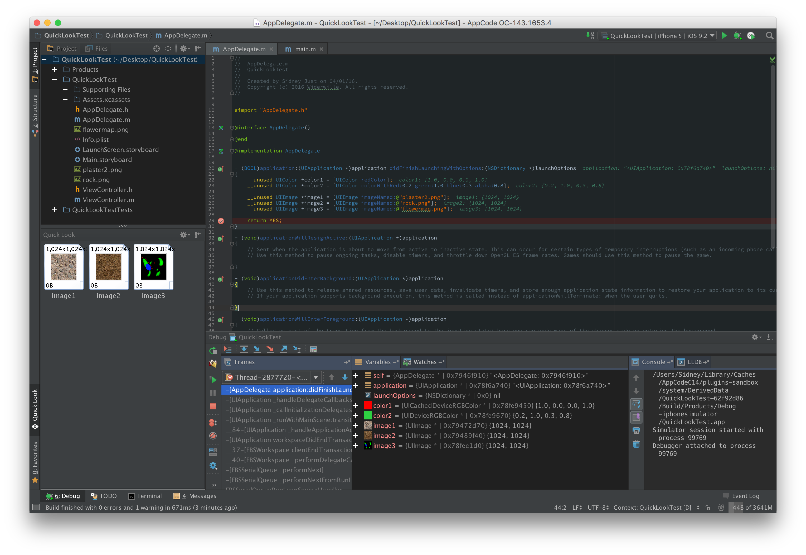
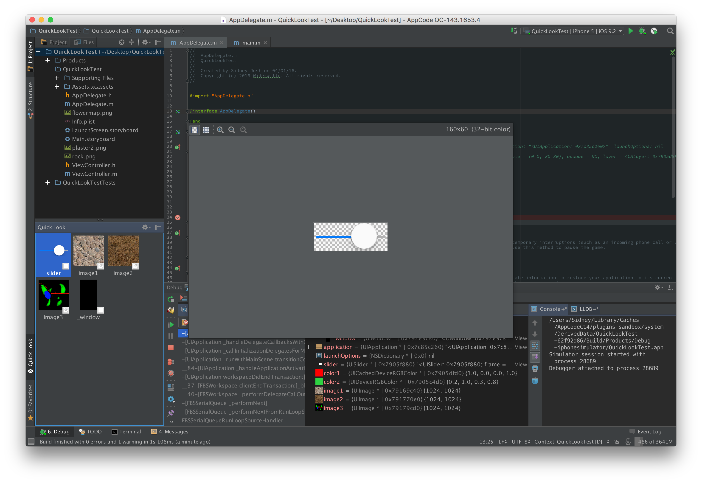

# Overview

Plugin that aims to provide similar functionality to Xcode's QuickLook debug renderer, which allows Xcode to render a plethora of values inline while debugging. A full reference of all the supported types supported by Xcode can be found [here](https://developer.apple.com/library/ios/documentation/IDEs/Conceptual/CustomClassDisplay_in_QuickLook/CH02-std_objects_support/CH02-std_objects_support.html).

# Currently supported

Right now this plugin only supports iOS and Objective-C. Here is a list of supported renderers for that platform

* UIImage
* UIImageView
* UIColor
* UIView subclasses
* Custom classes that implement `debugQuickLookObject` and which return one of the above objects

# Screenshots

# License

The code is available under the MIT license